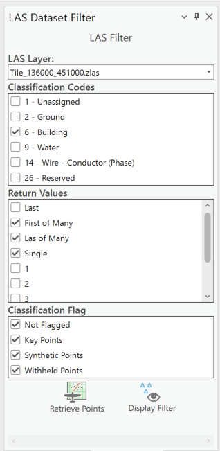

## LASDatasetAPISamples

<!-- TODO: Write a brief abstract explaining this sample -->
This sample illustrates LAS Dataset layer Api methods available.  
  


<a href="https://pro.arcgis.com/en/pro-app/sdk/" target="_blank">View it live</a>

<!-- TODO: Fill this section below with metadata about this sample-->
```
Language:              C#
Subject:               3DAnalyst
Contributor:           ArcGIS Pro SDK Team <arcgisprosdk@esri.com>
Organization:          Esri, https://www.esri.com
Date:                  10/01/2023
ArcGIS Pro:            3.2
Visual Studio:         2022
.NET Target Framework: net6.0-windows
```

## Resources

[Community Sample Resources](https://github.com/Esri/arcgis-pro-sdk-community-samples#resources)

### Samples Data

* Sample data for ArcGIS Pro SDK Community Samples can be downloaded from the [Releases](https://github.com/Esri/arcgis-pro-sdk-community-samples/releases) page.  

## How to use the sample
<!-- TODO: Explain how this sample can be used. To use images in this section, create the image file in your sample project's screenshots folder. Use relative url to link to this image using this syntax:  -->
1. Download the Community Sample data (see under the 'Resources' section for downloading sample data)
2. Make sure that the Sample data is unzipped in c:\data  
3. The project used for this sample is 'C:\Data\3DAnalyst\_3DLayersMap.ppkx'  
4. In Visual Studio click the Build menu.Then select Build Solution.  
5. Launch the debugger to open ArcGIS Pro.  
6. ArcGIS Pro will open, select the 3DLayersMap.ppkx project package. Note: Alternatively, you can open any map with a LAS layer. Using this sample, you will be retrieving LAS points and storing them in PointsFromLASLayer point feature class available in the project's home folder.  So this feature class needs to be in your map with the LAS layer.  
7. If using 3DLayersMap.ppkx, activate the Las map. This map has a Tile_136000_451000.zlas and a PointsFromLASLayer layer. The PointsFromLASLayer layer is empty.  
8. Click the LAS Dataset API tab. Explore the controls available on this tab.  
  
9. The "Filter Settings" button opens the "Las Dataset Filter" dockpane. Pick the Las dataset layer from the drop down (if you have multiple LAS layers in your map). This dockpane allows you to set the options for the LAS Dataset's classification codes, return values and classification flags. The current values for these settings from the LAS layer are pre-populated in the dockpane. The dockpane is shown below.   
  
10. You can now modify these setting values for the class codes, return values and the flags. Click the Display Filter or the Retrieve Points buttons.  
11. Display Filter button: This button allows you to visualize the points that satisfy filters set for Classification Codes, Return Values and Classification Flags.  
12. Retrieve Points button: This button allows you to retrieve the points in the LAS dataset that satisfy the criteria set in the filter. The retrieved points will be saved in the PointsFromLASLayer feature class.  
13. The "Las Symbology" gallery allows you to symbolize the LAS Dataset using points, lines or surface renderers.  
  

<!-- End -->

&nbsp;&nbsp;&nbsp;&nbsp;&nbsp;&nbsp;
&nbsp;&nbsp;&nbsp;&nbsp;&nbsp;&nbsp;&nbsp;&nbsp;&nbsp;&nbsp;&nbsp;&nbsp;
[Home](https://github.com/Esri/arcgis-pro-sdk/wiki) | <a href="https://pro.arcgis.com/en/pro-app/latest/sdk/api-reference" target="_blank">API Reference</a> | [Requirements](https://github.com/Esri/arcgis-pro-sdk/wiki#requirements) | [Download](https://github.com/Esri/arcgis-pro-sdk/wiki#installing-arcgis-pro-sdk-for-net) | <a href="https://github.com/esri/arcgis-pro-sdk-community-samples" target="_blank">Samples</a>
