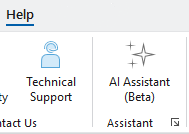

## AILayoutFunction

<!-- TODO: Write a brief abstract explaining this sample -->
This sample demonstrates how to add custom behavior to the ArcGIS Pro Assistant using the AIAssistantExtension and AIAssistantFunction attributes.  
  


<a href="https://pro.arcgis.com/en/pro-app/sdk/" target="_blank">View it live</a>

<!-- TODO: Fill this section below with metadata about this sample-->
```
Language:              C#
Subject:               Framework
Contributor:           ArcGIS Pro SDK Team <arcgisprosdk@esri.com>
Organization:          Esri, https://www.esri.com
Date:                  11/01/2025
ArcGIS Pro:            3.6
Visual Studio:         2022
.NET Target Framework: net8.0-windows
```

## Resources

[Community Sample Resources](https://github.com/Esri/arcgis-pro-sdk-community-samples#resources)

### Samples Data

* Sample data for ArcGIS Pro SDK Community Samples can be downloaded from the [Releases](https://github.com/Esri/arcgis-pro-sdk-community-samples/releases) page.  

## How to use the sample
<!-- TODO: Explain how this sample can be used. To use images in this section, create the image file in your sample project's screenshots folder. Use relative url to link to this image using this syntax:  -->
1. This sample is based on the instructions found at https://github.com/Esri/arcgis-pro-sdk/wiki/ProGuide-Create-an-AI-Assistant-Function
2. (Optional)Download the Community Sample data (see under the 'Resources' section for downloading sample data). The sample data can be used to test this add-in with prepackaged map documents.  
3. In Visual Studio click the Build menu. Then select Build Solution.   
4. Launch the debugger to open ArcGIS Pro.  
5. Use any existing project or create a new project in ArcGIS Pro with some content.  
6. Click the Help tab. You should get the AI Assistant button.  
       
7. This button opens the AI Assitant pane, in which you can interact with the AI Assistant.   
8. Type "Create a layout using the current map" in the AI Assistant pane and press the Enter key (or click the arrow).  
9. Also try typing "create a layout for the current map with a legend, a scalebar, a north arrow and titled "Enhanced layout" and press the Enter key (or click the arrow).  
10. You can try various combination of the parameters to confirm this works the way intended.  
  

<!-- End -->

&nbsp;&nbsp;&nbsp;&nbsp;&nbsp;&nbsp;
&nbsp;&nbsp;&nbsp;&nbsp;&nbsp;&nbsp;&nbsp;&nbsp;&nbsp;&nbsp;&nbsp;&nbsp;
[Home](https://github.com/Esri/arcgis-pro-sdk/wiki) | <a href="https://pro.arcgis.com/en/pro-app/latest/sdk/api-reference" target="_blank">API Reference</a> | [Requirements](https://github.com/Esri/arcgis-pro-sdk/wiki#requirements) | [Download](https://github.com/Esri/arcgis-pro-sdk/wiki#installing-arcgis-pro-sdk-for-net) | <a href="https://github.com/esri/arcgis-pro-sdk-community-samples" target="_blank">Samples</a>
