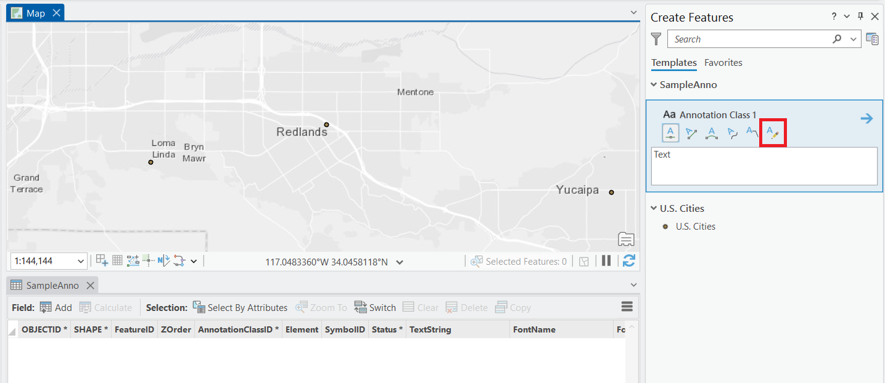
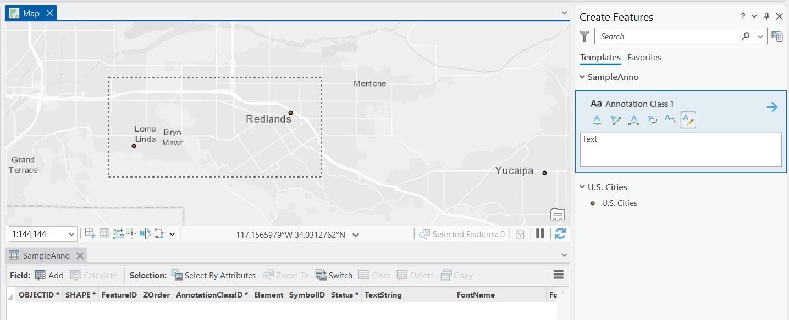
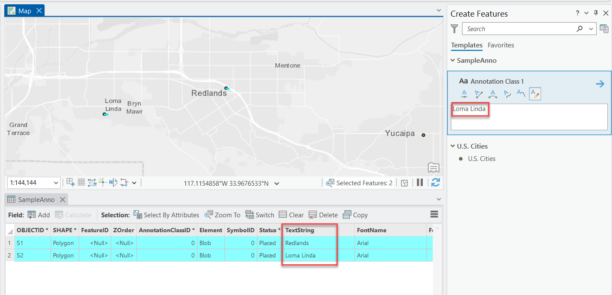

## AnnotationRetrofit

<!-- TODO: Write a brief abstract explaining this sample -->
This sample illustrates how to implement an annotation feature construction tool that uses a tool to select a set of point features, and then creates a new annotation feature for each selected point by using the selected point's geometry and text.  
  


<a href="https://pro.arcgis.com/en/pro-app/sdk/" target="_blank">View it live</a>

<!-- TODO: Fill this section below with metadata about this sample-->
```
Language:              C#
Subject:               Framework
Contributor:           ArcGIS Pro SDK Team <arcgisprosdk@esri.com>
Organization:          Esri, https://www.esri.com
Date:                  11/01/2025
ArcGIS Pro:            3.6
Visual Studio:         2022
.NET Target Framework: net8.0-windows
```

## Resources

[Community Sample Resources](https://github.com/Esri/arcgis-pro-sdk-community-samples#resources)

### Samples Data

* Sample data for ArcGIS Pro SDK Community Samples can be downloaded from the [Releases](https://github.com/Esri/arcgis-pro-sdk-community-samples/releases) page.  

## How to use the sample
<!-- TODO: Explain how this sample can be used. To use images in this section, create the image file in your sample project's screenshots folder. Use relative url to link to this image using this syntax:  -->
1. Download the Community Sample data (see under the 'Resources' section for downloading sample data)
2. Make sure that the Sample data is unzipped in c:\data   
3. The project used for this sample is 'C:\Data\SampleAnnoTwo\SampleAnno.aprx'  
4. In Visual studio click the Build menu. Then select Build Solution.  
5. Start the Debugger to open ArcGIS Pro.  
6. ArcGIS Pro will open, select the SampleAnno.aprx project  
7. To use this tool you have to start editing by clicking the 'Create [features]' button.  Then use the Create Features dockpane to select the 'Retrofit Annotation for points' tool.  
  
8. When the tool has been activated, rubber band select a few cities to create the matching annotation strings and point geometry.  
  
9. Once the point feature selection (via the rubber banding) is complete, the tool creates an annotation feature for each selected point.  The tool is using the point's geometry to create the annotation and the 'CITY_NAME' attribute value as the annotation text.  
  
10. You might have to zoom in, in order to view the newly created annotation features.  
  

<!-- End -->

&nbsp;&nbsp;&nbsp;&nbsp;&nbsp;&nbsp;
&nbsp;&nbsp;&nbsp;&nbsp;&nbsp;&nbsp;&nbsp;&nbsp;&nbsp;&nbsp;&nbsp;&nbsp;
[Home](https://github.com/Esri/arcgis-pro-sdk/wiki) | <a href="https://pro.arcgis.com/en/pro-app/latest/sdk/api-reference" target="_blank">API Reference</a> | [Requirements](https://github.com/Esri/arcgis-pro-sdk/wiki#requirements) | [Download](https://github.com/Esri/arcgis-pro-sdk/wiki#installing-arcgis-pro-sdk-for-net) | <a href="https://github.com/esri/arcgis-pro-sdk-community-samples" target="_blank">Samples</a>
