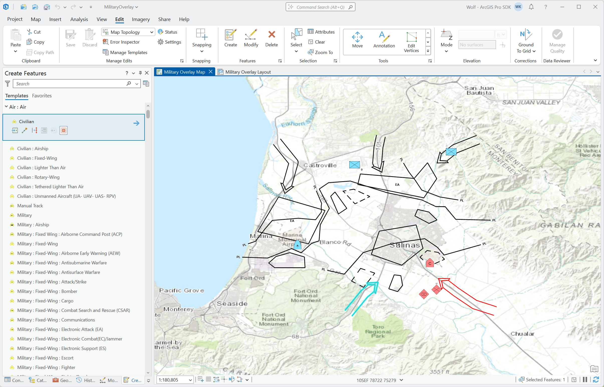
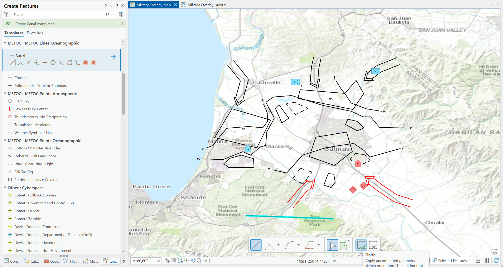
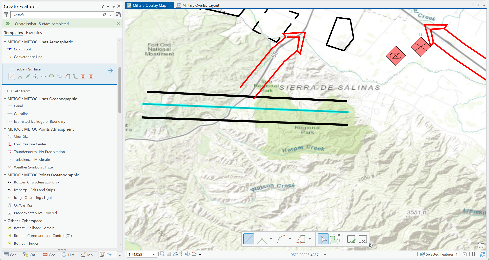
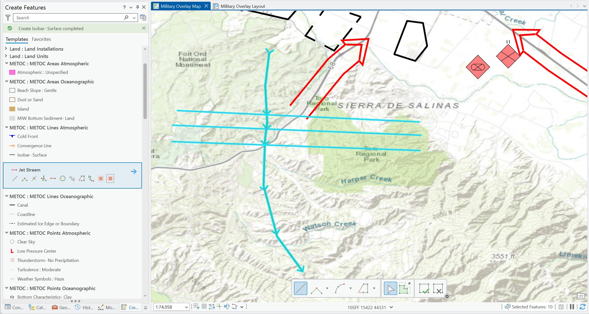
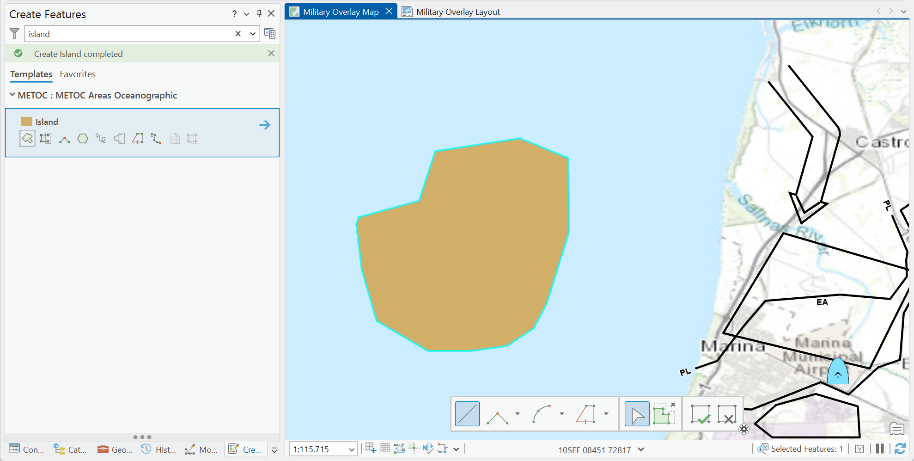
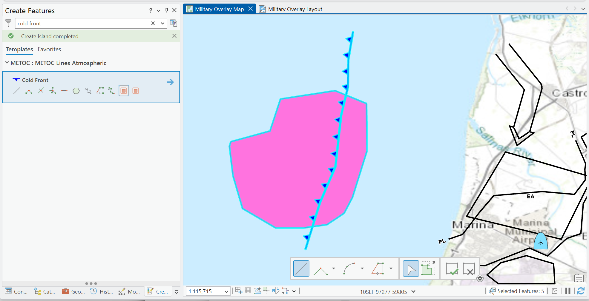

## ConstructionSplitTool

<!-- TODO: Write a brief abstract explaining this sample -->


<a href="https://pro.arcgis.com/en/pro-app/sdk/" target="_blank">View it live</a>

<!-- TODO: Fill this section below with metadata about this sample-->
```
Language:              C#
Subject:               Editing
Contributor:           ArcGIS Pro SDK Team <arcgisprosdk@esri.com>
Organization:          Esri, https://www.esri.com
Date:                  11/01/2025
ArcGIS Pro:            3.6
Visual Studio:         2022
.NET Target Framework: net8.0-windows
```

## Resources

[Community Sample Resources](https://github.com/Esri/arcgis-pro-sdk-community-samples#resources)

### Samples Data

* Sample data for ArcGIS Pro SDK Community Samples can be downloaded from the [Releases](https://github.com/Esri/arcgis-pro-sdk-community-samples/releases) page.  

## How to use the sample
<!-- TODO: Explain how this sample can be used. To use images in this section, create the image file in your sample project's screenshots folder. Use relative url to link to this image using this syntax:  -->
1. In Visual Studio click the Build menu. Then select Build Solution.
2. Launch the debugger to open ArcGIS Pro.  
3. Open any project that has a map with multiple line, point and polygon layers, for example: C:\Data\MilitaryOverlay\MilitaryOverlay.aprx'   
4. From Edit tab, open Create Features pane.  
5. Click to activate the Civilian feature template for the Air layer.  
  
6. Search for ‘Canal’ feature template and create a feature using the normal Line tool   
  
7. Search for ‘Isobar-Surface’ feature template and create a line feature using the normal Line tool   
  
8. Search for ‘Jet Stream’ feature template and then activate the Split Lines tool.Create a feature that crosses the both Canal and Isobar-Surface features created in previous steps.Confirm that all 3 features are split at the intersections and seven features are now selected.   
  
9. Search for ‘Island’ feature template and create a polygon in the map.   
  
10. Search for the ‘Cold Front’ feature template then click to activate.  
11. Create a feature that crosses the Island polygon.   
  
  

<!-- End -->

&nbsp;&nbsp;&nbsp;&nbsp;&nbsp;&nbsp;
&nbsp;&nbsp;&nbsp;&nbsp;&nbsp;&nbsp;&nbsp;&nbsp;&nbsp;&nbsp;&nbsp;&nbsp;
[Home](https://github.com/Esri/arcgis-pro-sdk/wiki) | <a href="https://pro.arcgis.com/en/pro-app/latest/sdk/api-reference" target="_blank">API Reference</a> | [Requirements](https://github.com/Esri/arcgis-pro-sdk/wiki#requirements) | [Download](https://github.com/Esri/arcgis-pro-sdk/wiki#installing-arcgis-pro-sdk-for-net) | <a href="https://github.com/esri/arcgis-pro-sdk-community-samples" target="_blank">Samples</a>
