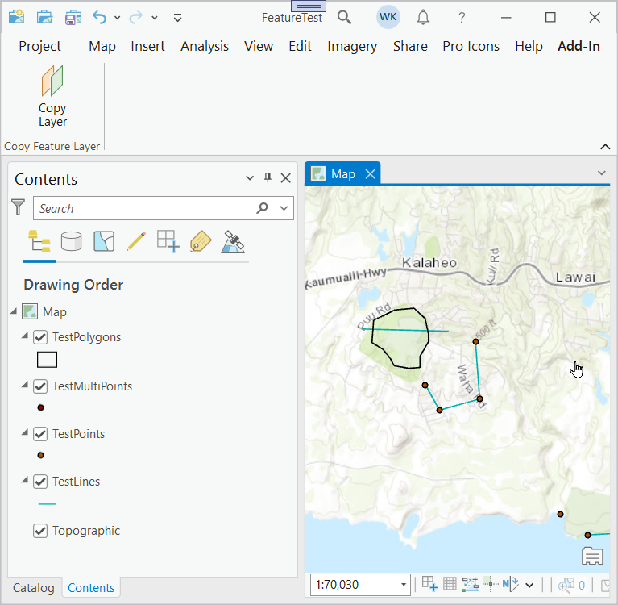
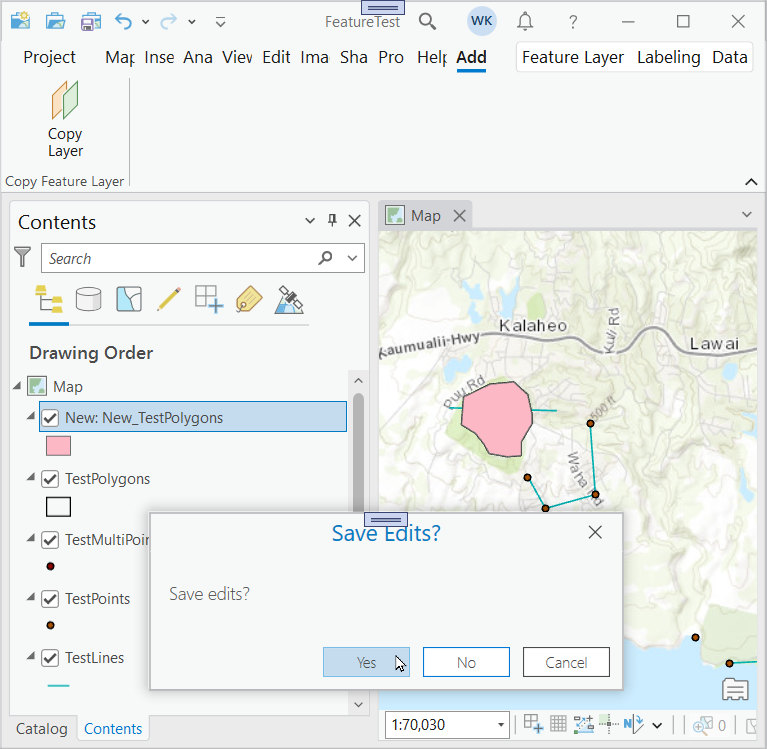

## CopyLayer

<!-- TODO: Write a brief abstract explaining this sample -->
This sample shows how to take an existing feature layer and create a copy of the feature class in the default geodatabase.  The spatial column's attributes are recreated in the new feature class and two columns are added.  Finally the existing spatial data is copied and the new feature class is added to the map's layers.  
  


<a href="https://pro.arcgis.com/en/pro-app/sdk/" target="_blank">View it live</a>

<!-- TODO: Fill this section below with metadata about this sample-->
```
Language:              C#
Subject:               Editing
Contributor:           ArcGIS Pro SDK Team <arcgisprosdk@esri.com>
Organization:          Esri, https://www.esri.com
Date:                  10/01/2023
ArcGIS Pro:            3.2
Visual Studio:         2022
.NET Target Framework: net6.0-windows
```

## Resources

[Community Sample Resources](https://github.com/Esri/arcgis-pro-sdk-community-samples#resources)

### Samples Data

* Sample data for ArcGIS Pro SDK Community Samples can be downloaded from the [Releases](https://github.com/Esri/arcgis-pro-sdk-community-samples/releases) page.  

## How to use the sample
<!-- TODO: Explain how this sample can be used. To use images in this section, create the image file in your sample project's screenshots folder. Use relative url to link to this image using this syntax:  -->
     
  
1. Open this solution in Visual Studio.
2. Click the build menu and select Build Solution.  
3. Launch the debugger to open ArCGIS Pro.   
4. Open any project with a map that contains either Point, Line or Polygon feature layers.  
5. Click on the 'Add-in' tab and note the 'Copy Feature Layer' group.  
  
6. Click the 'Copy Layer' button to create a copy of the first feature layer in the current active map's table of content.  
7. The add-in creates a copy of the first feature layer's feature class in the default geodatabase using the layer's spatial attributes.  
8. Then the add-in copies the existing spatial data to the new feature class and finally adds the new feature class to the map's table of content.  
  
  

<!-- End -->

&nbsp;&nbsp;&nbsp;&nbsp;&nbsp;&nbsp;
&nbsp;&nbsp;&nbsp;&nbsp;&nbsp;&nbsp;&nbsp;&nbsp;&nbsp;&nbsp;&nbsp;&nbsp;
[Home](https://github.com/Esri/arcgis-pro-sdk/wiki) | <a href="https://pro.arcgis.com/en/pro-app/latest/sdk/api-reference" target="_blank">API Reference</a> | [Requirements](https://github.com/Esri/arcgis-pro-sdk/wiki#requirements) | [Download](https://github.com/Esri/arcgis-pro-sdk/wiki#installing-arcgis-pro-sdk-for-net) | <a href="https://github.com/esri/arcgis-pro-sdk-community-samples" target="_blank">Samples</a>
