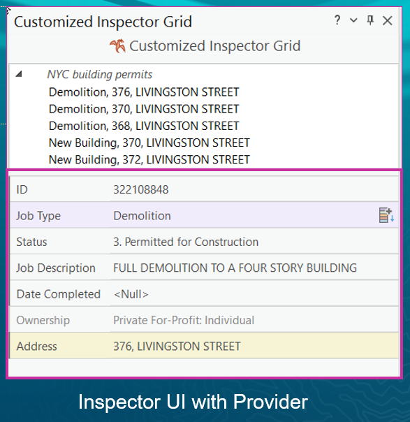

## EditorInspectorUI

<!-- TODO: Write a brief abstract explaining this sample -->
This sample demonstrates how to use the Inspector class to display field names and values of a feature in a grid like manner.  
You can also use the InspectorProvider class to create a more customized version of the inspector grid.  
  


<a href="https://pro.arcgis.com/en/pro-app/sdk/" target="_blank">View it live</a>

<!-- TODO: Fill this section below with metadata about this sample-->
```
Language:              C#
Subject:               Editing
Contributor:           ArcGIS Pro SDK Team <arcgisprosdk@esri.com>
Organization:          Esri, https://www.esri.com
Date:                  04/04/2024
ArcGIS Pro:            3.3
Visual Studio:         2022
.NET Target Framework: net8.0-windows
```

## Resources

[Community Sample Resources](https://github.com/Esri/arcgis-pro-sdk-community-samples#resources)

### Samples Data

* Sample data for ArcGIS Pro SDK Community Samples can be downloaded from the [Releases](https://github.com/Esri/arcgis-pro-sdk-community-samples/releases) page.  

## How to use the sample
<!-- TODO: Explain how this sample can be used. To use images in this section, create the image file in your sample project's screenshots folder. Use relative url to link to this image using this syntax:  -->
1. In Visual Studio click the Build menu. Then select Build Solution.
2. Click Start button to open ArcGIS Pro.  
3. ArcGIS Pro will open.   
4. Open Data\Editing\InspectorUI.ppkx from the Sample Data  
5. Activate the "NYC Building permits" map if it is not already active. 5 features will be selected in this map.  
6. Click the "Inspector UI" tab on the ribbon.  
7. Click the "My Inspector Grid" button. This will display the Inspector dockpane.  
  
8. You can now modify this sample to use the InsepctorProvider class to customize the Inspector Grid. InsepctorProvider base class allows you to create a more customized version of the inspector grid. Open the MyProvider.cs class. Notice how it derives from the InspectorProvider base class and implements various callbacks to customize that specific aspect of the UI.  
9. Given below are some examples of how you can customize the Inspector Grid using the InspectorProvider class callbacks:  
     * Change field visibility,   
     * Sets fields to be read-only, highlighted,   
     * Customizes field order in the grid,  
     * Adds validation  
     * Modifies field name display.  
10. Open the DockpaneInspectorUIViewModel.cs.Follow the "TODO" comments in the "Show" method in this class file to use the Inspector Provider class to customize the Inspector Grid.  
11. Hot reload the change in the code and click the "My Inspector Grid" tab on the ribbon. Notice the customized Inspector UI.  
  
  

<!-- End -->

&nbsp;&nbsp;&nbsp;&nbsp;&nbsp;&nbsp;
&nbsp;&nbsp;&nbsp;&nbsp;&nbsp;&nbsp;&nbsp;&nbsp;&nbsp;&nbsp;&nbsp;&nbsp;
[Home](https://github.com/Esri/arcgis-pro-sdk/wiki) | <a href="https://pro.arcgis.com/en/pro-app/latest/sdk/api-reference" target="_blank">API Reference</a> | [Requirements](https://github.com/Esri/arcgis-pro-sdk/wiki#requirements) | [Download](https://github.com/Esri/arcgis-pro-sdk/wiki#installing-arcgis-pro-sdk-for-net) | <a href="https://github.com/esri/arcgis-pro-sdk-community-samples" target="_blank">Samples</a>
