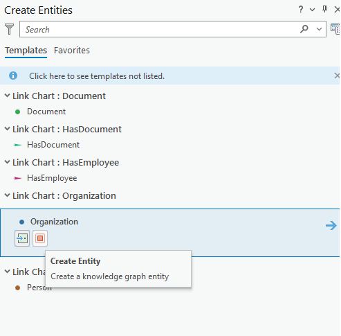
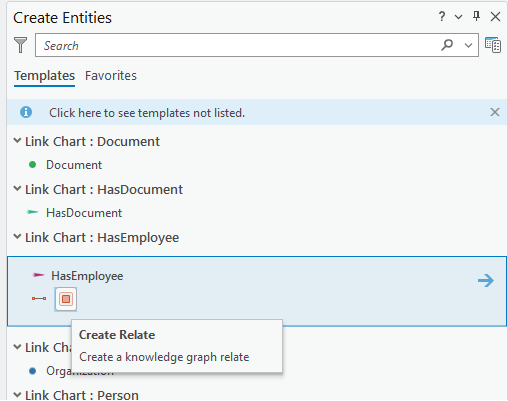
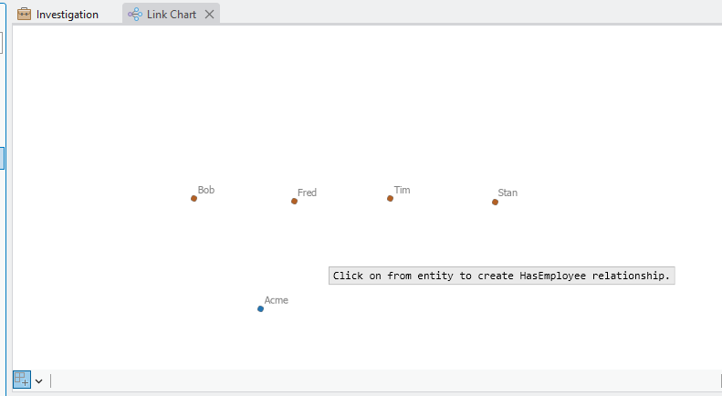
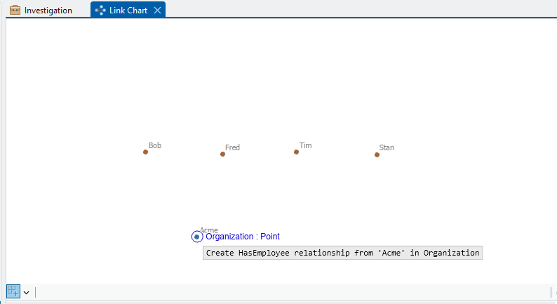
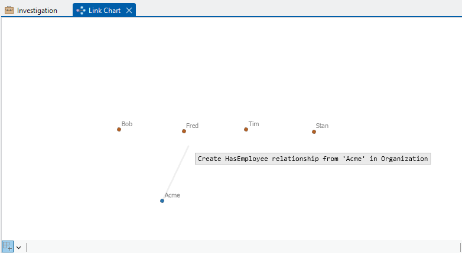

## KnowledgeGraphConstructionTools

<!-- TODO: Write a brief abstract explaining this sample -->
This sample illustrates how to build construction tools for KnowledgeGraph entity and relationships.   
The sketch tool displays a UI on the overlay using the OverlayControlID property of the MapTool.   
The UI requires the user to specify the source and destination entity types along with the relate type and  the relate direction.   
The tool uses the SketchTip property to direct the user to identify a single source entity. Once a source entity has been found, the SketchTip is updated to direct the user to identify destination entities.   
Once destination entities have been found, the edit is performed for each source and destination entity pair.   
  


<a href="https://pro.arcgis.com/en/pro-app/sdk/" target="_blank">View it live</a>

<!-- TODO: Fill this section below with metadata about this sample-->
```
Language:              C#
Subject:               Editing
Contributor:           ArcGIS Pro SDK Team <arcgisprosdk@esri.com>
Organization:          Esri, https://www.esri.com
Date:                  11/04/2024
ArcGIS Pro:            3.4
Visual Studio:         2022
.NET Target Framework: net8.0-windows
```

## Resources

[Community Sample Resources](https://github.com/Esri/arcgis-pro-sdk-community-samples#resources)

### Samples Data

* Sample data for ArcGIS Pro SDK Community Samples can be downloaded from the [Releases](https://github.com/Esri/arcgis-pro-sdk-community-samples/releases) page.  

## How to use the sample
<!-- TODO: Explain how this sample can be used. To use images in this section, create the image file in your sample project's screenshots folder. Use relative url to link to this image using this syntax:  -->
1. In Visual Studio click the Build menu.Then select Build Solution.
2. Launch the debugger to open ArcGIS Pro.  
3. ArcGIS Pro will open, select a project containing a link chart with a KnowledgeGraph.   
4. Open the Create features window and activate an entity template to see the custom construction tool for entities.  
        
5. Activate the custom construction tool and click on the link chart to create an entity.   
6. Open the Create features window and activate a relate template to see the custom construction tool for relationships.  
        
7. Activate the custom construction tool and move your mouse over the link chart.  Note the SketchTip and cursor  
        
8. Hover over an entity and see the SketchTip and Cursor change.  
        
9. Click on an entity to identify it as the origin entity. Notice the SketchTip and the connecting line draw  on the overlay as you move the mouse.  
        
10. Hover over a second entity. Notice the SketchTip, Cursor and overlay change.  
        
11. Click on the entity to identify it as the destination entity. The relationship record is created.  
        
  

<!-- End -->

&nbsp;&nbsp;&nbsp;&nbsp;&nbsp;&nbsp;
&nbsp;&nbsp;&nbsp;&nbsp;&nbsp;&nbsp;&nbsp;&nbsp;&nbsp;&nbsp;&nbsp;&nbsp;
[Home](https://github.com/Esri/arcgis-pro-sdk/wiki) | <a href="https://pro.arcgis.com/en/pro-app/latest/sdk/api-reference" target="_blank">API Reference</a> | [Requirements](https://github.com/Esri/arcgis-pro-sdk/wiki#requirements) | [Download](https://github.com/Esri/arcgis-pro-sdk/wiki#installing-arcgis-pro-sdk-for-net) | <a href="https://github.com/esri/arcgis-pro-sdk-community-samples" target="_blank">Samples</a>
