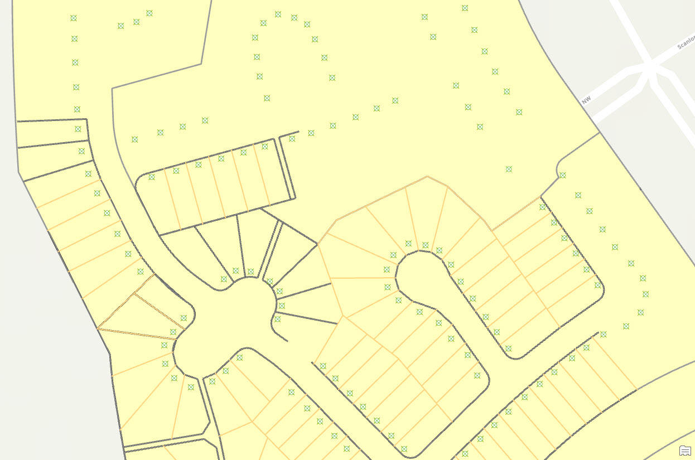
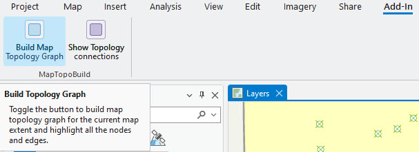
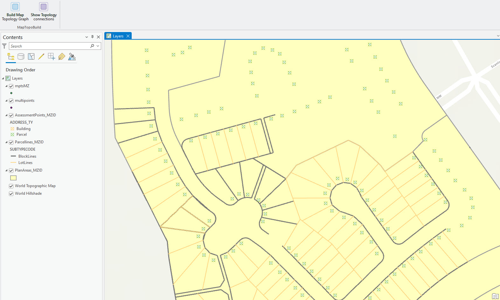
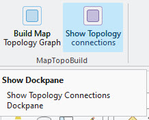
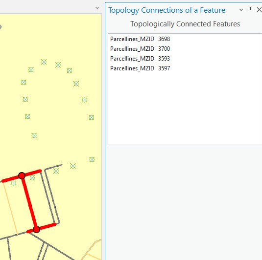
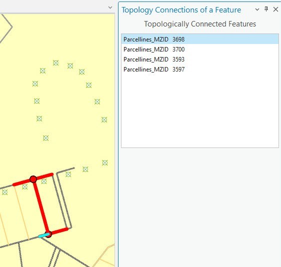

## MapTopologyAddIn

<!-- TODO: Write a brief abstract explaining this sample -->
This sample provides two buttons on the AddIn tab in ArcGIS Pro. One of them (Build Map Topology Graph button), builds the map topology graph  for the current map view extent and shows the number of nodes and edges in that graph in a popup window.  
The 2nd button ("Show Topology connections") allows you to open up a custom dock pane that will help you identify all the topologically  connected features for the currently selected feature in the map.  
  


<a href="https://pro.arcgis.com/en/pro-app/sdk/" target="_blank">View it live</a>

<!-- TODO: Fill this section below with metadata about this sample-->
```
Language:              C#
Subject:               Editing
Contributor:           ArcGIS Pro SDK Team <arcgisprosdk@esri.com>
Organization:          Esri, https://www.esri.com
Date:                  05/06/2025
ArcGIS Pro:            3.5
Visual Studio:         2022
.NET Target Framework: net8.0-windows
```

## Resources

[Community Sample Resources](https://github.com/Esri/arcgis-pro-sdk-community-samples#resources)

### Samples Data

* Sample data for ArcGIS Pro SDK Community Samples can be downloaded from the [Releases](https://github.com/Esri/arcgis-pro-sdk-community-samples/releases) page.  

## How to use the sample
<!-- TODO: Explain how this sample can be used. To use images in this section, create the image file in your sample project's screenshots folder. Use relative url to link to this image using this syntax:  -->
1. In Visual Studio click the Build menu. Then select Build Solution.
2. Click Start button to open ArcGIS Pro.    
3. ArcGIS Pro will open.    
4. Open a map view that contains editable points, polylines and/or polygon data.    
    
5. Click on the AddIn tab on the ribbon. You will see a group named Map Topology AddIn and two buttons in that group named "build Map Topology Graph" and "Show Topology connections".    
    
    
**Part I:**    
    
6. Click on the "Build Map Topology Graph" button. Notice that the button is now toggled ON and appears in the color blue to indicate it is toggled ON. What this does, is it creates the map topology graph for the current extent of the map that is visible on the screen, and it highlights all the nodes and edges that are part of the graph. It also displays a window showing the number of nodes and edges in the graph created. Hit OK in the popup window.    
    
7. Click the "Build Map Topology Graph" button again. You will see that the button is toggled OFF and the overlay containing the nodes and edges is cleared from the map.    
    
8. Now, zoom or pan on the map to change it's extent or what is displayed in the map. Then try step 6 again and watch how the results vary according to the map extent. Clear the overlay when done by toggling the button OFF.    
    
**Part II:**    
    
9. Click the "Show Topology connections" button from the AddIn tab on the ribbon.    
    
10. A custom dockpane opens up with the name "Topology connections of a feature".    
    
11. From the Edit tab or the Map tab on the ribbon, enable the selection tool and select a feature on the map.    
    
12. All the nodes and edges connected to the selected feature on the map, will be highlighted, and all the features that are topologically connected to the selected feature will be listed on the dockpane by their Feature Class Name and Object ID.    
    
13. Click on one of the features listed on the pane, and that feature will flash on the map view.    
    
14. Select any other feature using the selection tool. You'll find that the previous overlay is cleared and the results for the newly selected feature is displayed.    
  

<!-- End -->

&nbsp;&nbsp;&nbsp;&nbsp;&nbsp;&nbsp;
&nbsp;&nbsp;&nbsp;&nbsp;&nbsp;&nbsp;&nbsp;&nbsp;&nbsp;&nbsp;&nbsp;&nbsp;
[Home](https://github.com/Esri/arcgis-pro-sdk/wiki) | <a href="https://pro.arcgis.com/en/pro-app/latest/sdk/api-reference" target="_blank">API Reference</a> | [Requirements](https://github.com/Esri/arcgis-pro-sdk/wiki#requirements) | [Download](https://github.com/Esri/arcgis-pro-sdk/wiki#installing-arcgis-pro-sdk-for-net) | <a href="https://github.com/esri/arcgis-pro-sdk-community-samples" target="_blank">Samples</a>
