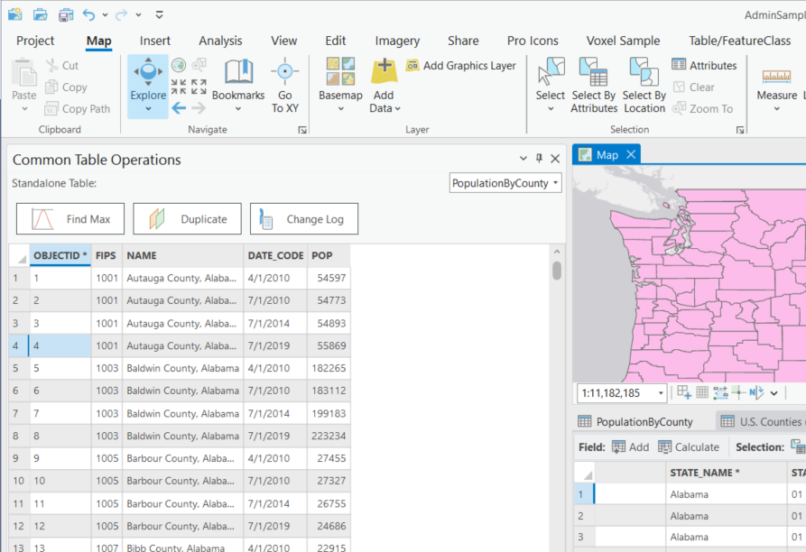
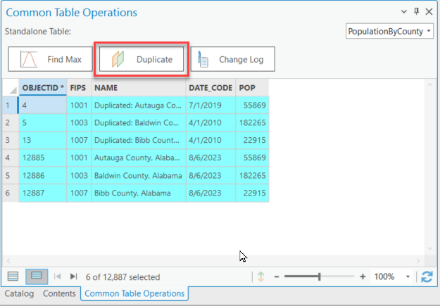
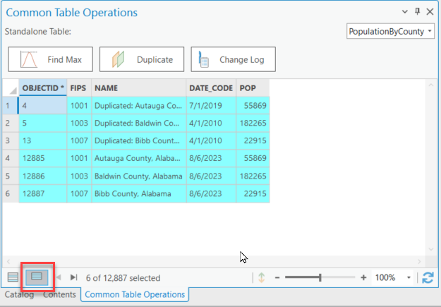
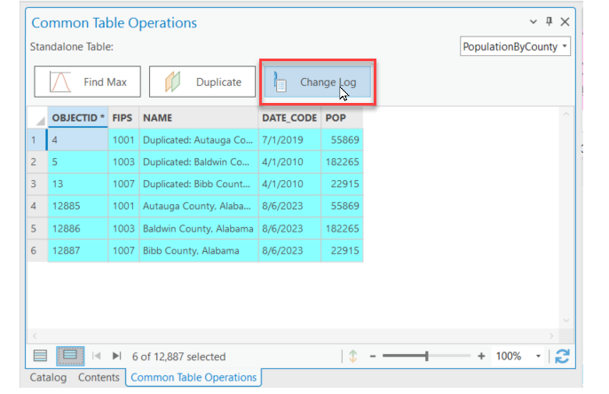
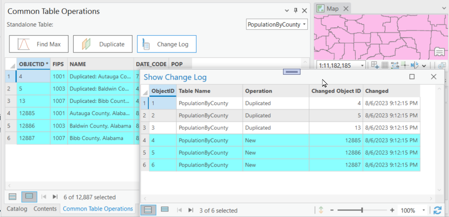

## TableFeatureClassOperations

<!-- TODO: Write a brief abstract explaining this sample -->
This code sample demonstrates how to perform some a sequence of edit operations.   It will compute the maximum value of a specific field, duplicate records, select newly created records, update old records, and create a log of the changes performed on a table.  
  


<a href="https://pro.arcgis.com/en/pro-app/sdk/" target="_blank">View it live</a>

<!-- TODO: Fill this section below with metadata about this sample-->
```
Language:              C#
Subject:               Editing
Contributor:           ArcGIS Pro SDK Team <arcgisprosdk@esri.com>
Organization:          Esri, https://www.esri.com
Date:                  11/04/2024
ArcGIS Pro:            3.4
Visual Studio:         2022
.NET Target Framework: net8.0-windows
```

## Resources

[Community Sample Resources](https://github.com/Esri/arcgis-pro-sdk-community-samples#resources)

### Samples Data

* Sample data for ArcGIS Pro SDK Community Samples can be downloaded from the [Releases](https://github.com/Esri/arcgis-pro-sdk-community-samples/releases) page.  

## How to use the sample
<!-- TODO: Explain how this sample can be used. To use images in this section, create the image file in your sample project's screenshots folder. Use relative url to link to this image using this syntax:  -->
1. Download the Community Sample data (see under the 'Resources' section for downloading sample data). The sample data contains an ArcGIS Pro project and data to be used for this sample. Make sure that the Sample data is unzipped in c:\data and C:\Data\Admin is available.
2. In Visual Studio click the Build menu. Then select Build Solution.  
3. You can run the add-in using the debugger, but to see its full functionality you should run the add-in wihtout the debugger first since some of the functionality like Progress Dialogs are not supported when running ArcGIS Pro from the debugger.  
4. Open the project 'C:\Data\Admin\AdminSample.aprx'.    
5. Add 'PopulationByCounty' as a standalone table to the map.  
6. Add a new field to the 'U.S. Counties (Generalized)' feature class called 'Changed' of type 'Date'.  
7. Select the 'Table/FeatureClass' tab, and then click on 'Common Table Operations' to bring up the 'Common Table Operations' dockpane.  
8. From the 'Standalone Table' dropdown select 'PopulationByCounty':  
    
9. Select one or more records in the 'PopulationByCounty' table on the 'Common Table Operations' dockpane.    
    
10. Click the 'Duplicate' button to duplicate the selected records.  
    
11. Click the 'Show Selected Records' on the bottom of the 'PopulationByCounty' Table.  
    
12. Click the 'Change Log' button in order to show the 'Change Log' dialog.     
    
    
  

<!-- End -->

&nbsp;&nbsp;&nbsp;&nbsp;&nbsp;&nbsp;
&nbsp;&nbsp;&nbsp;&nbsp;&nbsp;&nbsp;&nbsp;&nbsp;&nbsp;&nbsp;&nbsp;&nbsp;
[Home](https://github.com/Esri/arcgis-pro-sdk/wiki) | <a href="https://pro.arcgis.com/en/pro-app/latest/sdk/api-reference" target="_blank">API Reference</a> | [Requirements](https://github.com/Esri/arcgis-pro-sdk/wiki#requirements) | [Download](https://github.com/Esri/arcgis-pro-sdk/wiki#installing-arcgis-pro-sdk-for-net) | <a href="https://github.com/esri/arcgis-pro-sdk-community-samples" target="_blank">Samples</a>
