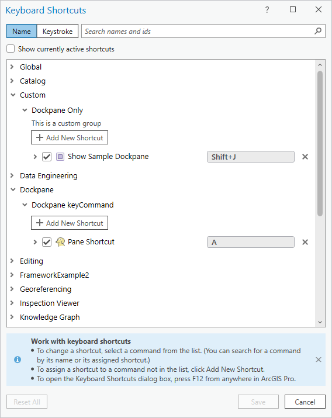
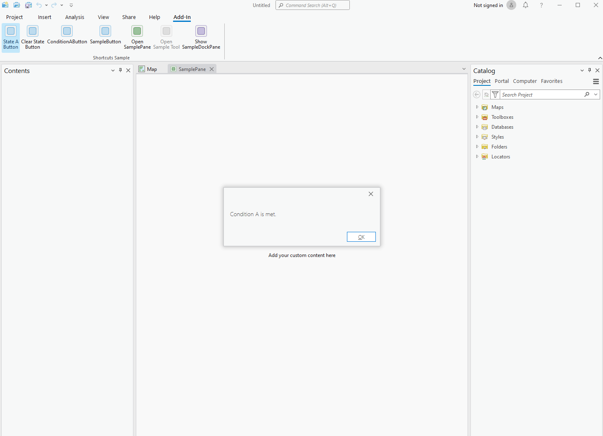

## KeyboardShortcuts

<!-- TODO: Write a brief abstract explaining this sample -->
This sample provides an overview of the Keyboard Shortcuts framework. Examples include: Global Accelerator, keyUp shortcut, conditional shortcut, Pane and Dockpane shortcut via keyCommand  
  


<a href="https://pro.arcgis.com/en/pro-app/sdk/" target="_blank">View it live</a>

<!-- TODO: Fill this section below with metadata about this sample-->
```
Language:              C#
Subject:               Framework
Contributor:           ArcGIS Pro SDK Team <arcgisprosdk@esri.com>
Organization:          Esri, https://www.esri.com
Date:                  04/04/2024
ArcGIS Pro:            3.3
Visual Studio:         2022
.NET Target Framework: net8.0-windows
```

## Resources

[Community Sample Resources](https://github.com/Esri/arcgis-pro-sdk-community-samples#resources)

### Samples Data

* Sample data for ArcGIS Pro SDK Community Samples can be downloaded from the [Releases](https://github.com/Esri/arcgis-pro-sdk-community-samples/releases) page.  

## How to use the sample
<!-- TODO: Explain how this sample can be used. To use images in this section, create the image file in your sample project's screenshots folder. Use relative url to link to this image using this syntax:  -->
1. In Visual Studio click the Build menu. Then select Build Solution.
2. Click Start button to open ArcGIS Pro.  
3. ArcGIS Pro will open.  
4. Open a project with a map or create a blank template and insert a map.  
5. Open a map view.   
6. Launch the Keyboard Shortcuts dialog with F12. Take a moment to inspect the Shortcut Tables.   
7. Expand the "Global" group. Scroll down to "Sample Button." This is a read-only accelerator added by this AddIn.  
8. Uncheck the "Show currently active shortcuts" checkbox at the top of the dialog.  
9. Expand the Custom group. This is an example of a Custom category added in this sample.  
10. Close the Keyboard Shortcuts dialog.  
11. Press `h` to invoke the Accelerator command. A message will appear.  
12. Activate the Map View.  
13. Press `k` to invoke a shortcut targeting the Map View.  
14. With the Map View still activated, press `Shift + j` to trigger a shortcut that opens a Sample Dockpane.  
15. With the Dockpane activated, press `a` - this will trigger a keyCommanmd shortcut on the Dockpane.  
16. Click on the Add-In ribbon tab and then click on the "Open Sample Pane" button in the Shortcuts Sample group. This will open a sample Pane.  
17. With the Sample Pane activated, click the "Toggle State A" in the Keyboard Shortcuts group. This will satisfy ConditionA which will allow invocation of a conditional shortcut.  
18. With the Sample Pane activated, press `l` - this will invoke the conditional shortcut.  
19. Dismiss the MessageBox and, with the Sample Pane still activated, press `r` - this will trigger a keyCommanmd shortcut on the Pane.  
20. Activate the Map View - this will enable the "Open Sample Tool" button. Click the button to simulate tool activation. Press `n` to invoke a shortcut targeted at the tool.  
    
    
  

<!-- End -->

&nbsp;&nbsp;&nbsp;&nbsp;&nbsp;&nbsp;
&nbsp;&nbsp;&nbsp;&nbsp;&nbsp;&nbsp;&nbsp;&nbsp;&nbsp;&nbsp;&nbsp;&nbsp;
[Home](https://github.com/Esri/arcgis-pro-sdk/wiki) | <a href="https://pro.arcgis.com/en/pro-app/latest/sdk/api-reference" target="_blank">API Reference</a> | [Requirements](https://github.com/Esri/arcgis-pro-sdk/wiki#requirements) | [Download](https://github.com/Esri/arcgis-pro-sdk/wiki#installing-arcgis-pro-sdk-for-net) | <a href="https://github.com/esri/arcgis-pro-sdk-community-samples" target="_blank">Samples</a>
