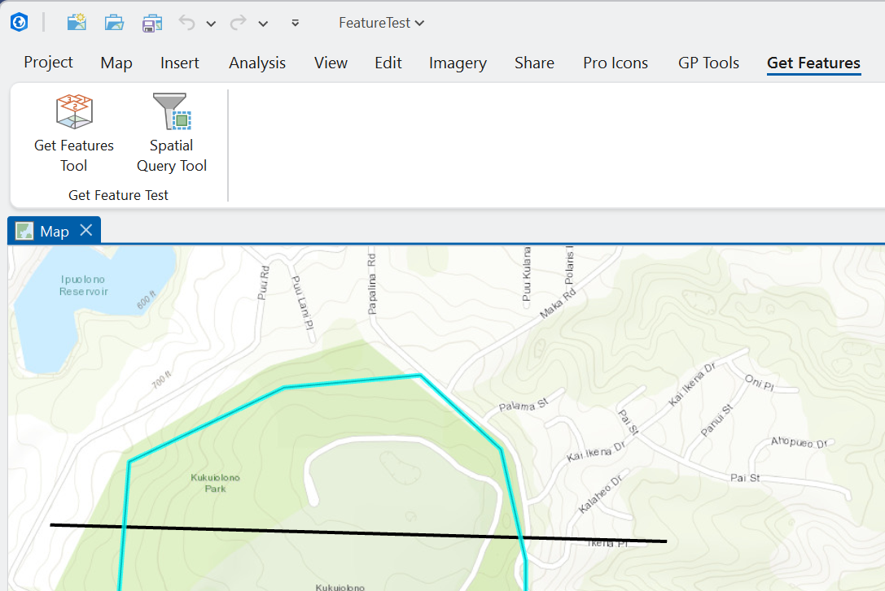
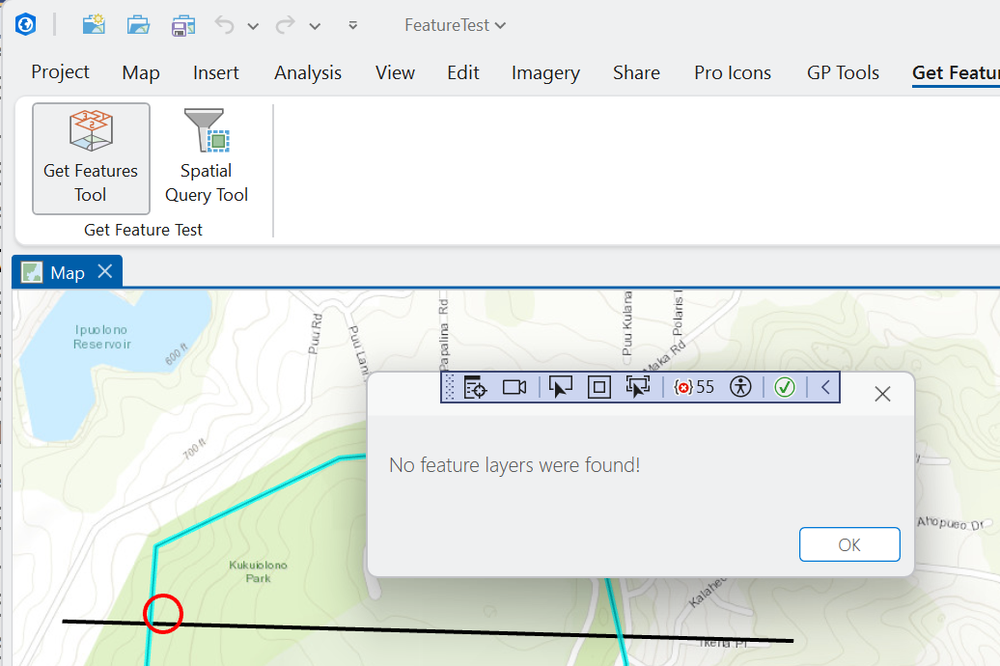
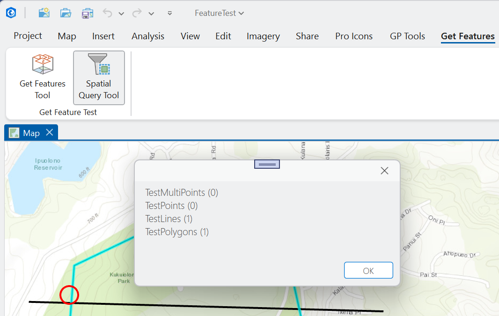

## ToolGetFeatures

<!-- TODO: Write a brief abstract explaining this sample -->
This sample demonstrates how to get underlying features from a map using a map tool click.  The sample shows two methods: GetFeatures and a spatial query.   
  


<a href="https://pro.arcgis.com/en/pro-app/sdk/" target="_blank">View it live</a>

<!-- TODO: Fill this section below with metadata about this sample-->
```
Language:              C#
Subject:               Map Exploration
Contributor:           ArcGIS Pro SDK Team <arcgisprosdk@esri.com>
Organization:          Esri, https://www.esri.com
Date:                  11/01/2025
ArcGIS Pro:            3.6
Visual Studio:         2022
.NET Target Framework: net8.0-windows
```

## Resources

[Community Sample Resources](https://github.com/Esri/arcgis-pro-sdk-community-samples#resources)

### Samples Data

* Sample data for ArcGIS Pro SDK Community Samples can be downloaded from the [Releases](https://github.com/Esri/arcgis-pro-sdk-community-samples/releases) page.  

## How to use the sample
<!-- TODO: Explain how this sample can be used. To use images in this section, create the image file in your sample project's screenshots folder. Use relative url to link to this image using this syntax:  -->
1. Download the Community Sample data(see under the "Resources" section for downloading sample data).  Make sure that the Sample data is unzipped in c:\data and "C:\Data\FeatureTest\FeatureTest.aprx" is available.
2. In Visual Studio click the Build menu.Then select Build Solution.    
3. Launch the debugger to open ArcGIS Pro.    
4. The project used for this sample is 'C:\Data\FeatureTest\FeatureTest.aprx'  .    
5. In ArcGIS Pro select the FeatureTest.aprx project.    
6. Select the 'Get Features' tab on the Pro ribbon.  
    
7. Select the 'Get Features Tool' tool and click on the map to get features at that location using the GetFeatures method.  The features found will be listed in a message box.  
    
8. Select the 'Spatial Query Tool' tool and click on the map to get features at that location using the spatial query method.  The features found will be listed in a message box.  
    
  

<!-- End -->

&nbsp;&nbsp;&nbsp;&nbsp;&nbsp;&nbsp;
&nbsp;&nbsp;&nbsp;&nbsp;&nbsp;&nbsp;&nbsp;&nbsp;&nbsp;&nbsp;&nbsp;&nbsp;
[Home](https://github.com/Esri/arcgis-pro-sdk/wiki) | <a href="https://pro.arcgis.com/en/pro-app/latest/sdk/api-reference" target="_blank">API Reference</a> | [Requirements](https://github.com/Esri/arcgis-pro-sdk/wiki#requirements) | [Download](https://github.com/Esri/arcgis-pro-sdk/wiki#installing-arcgis-pro-sdk-for-net) | <a href="https://github.com/esri/arcgis-pro-sdk-community-samples" target="_blank">Samples</a>
