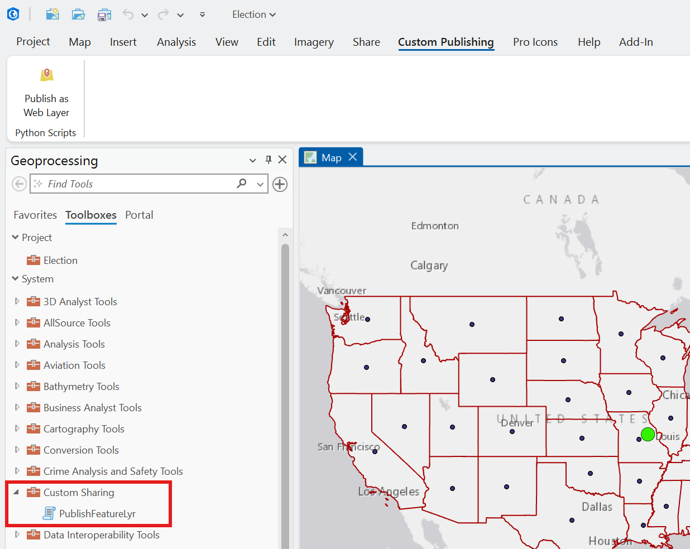
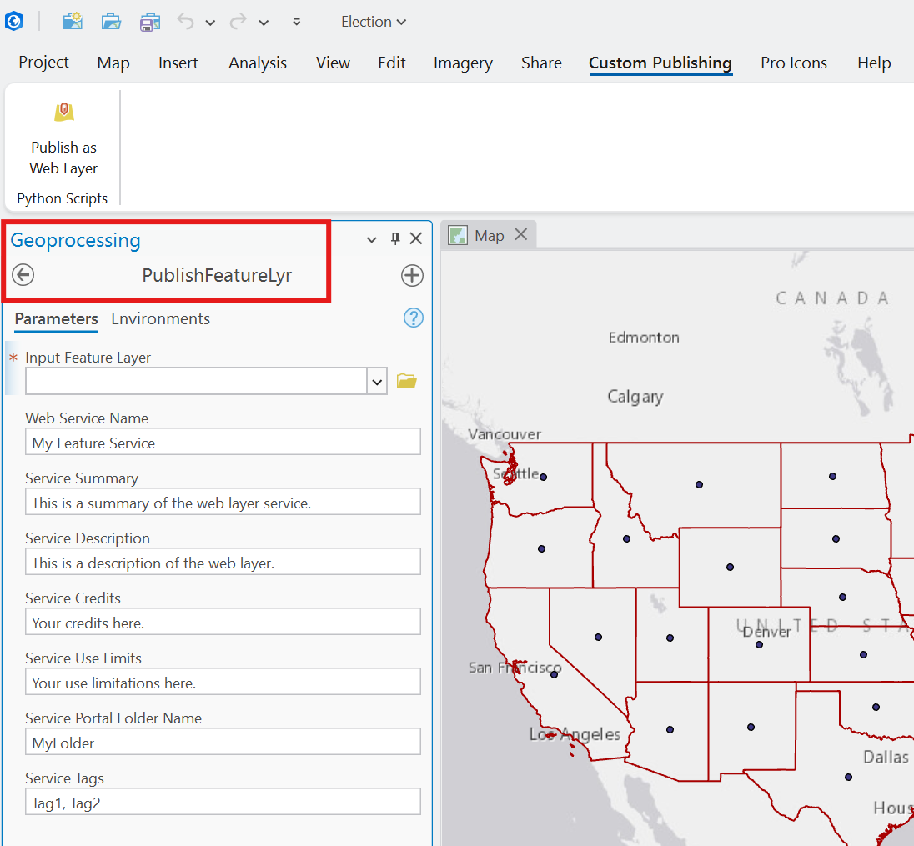
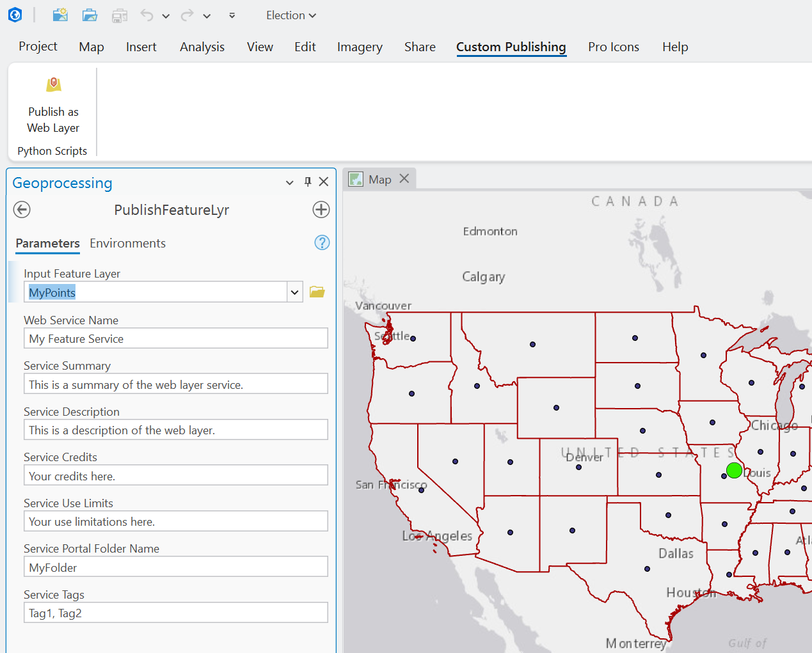
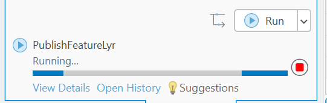
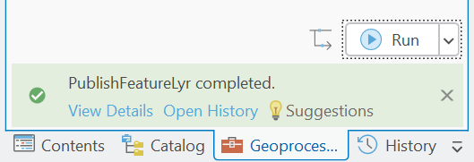
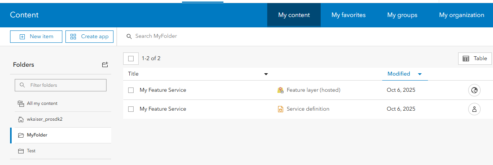
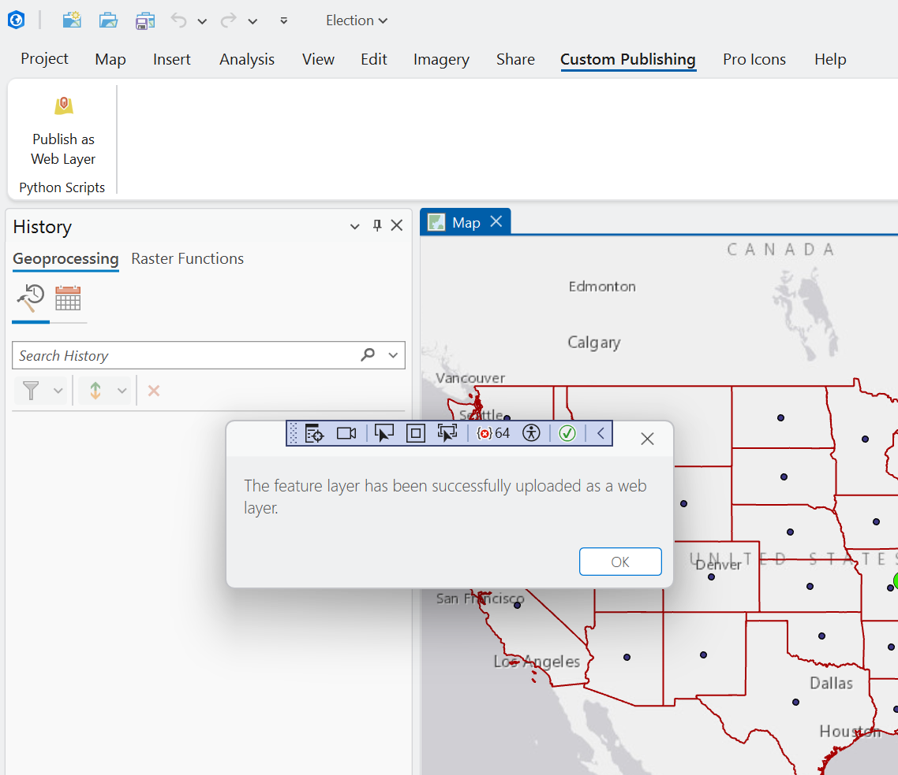
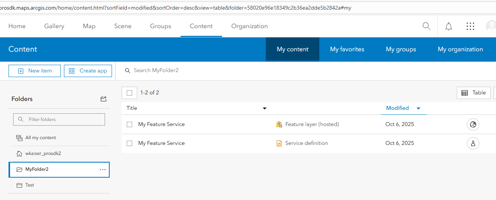

## FeatureLyrToWebLayer

<!-- TODO: Write a brief abstract explaining this sample -->
This Button add-in, when clicked, uses the first feature layer in the Map and publishes it as a Web Layer using a custom Python script.  
  


<a href="https://pro.arcgis.com/en/pro-app/sdk/" target="_blank">View it live</a>

<!-- TODO: Fill this section below with metadata about this sample-->
```
Language:              C#
Subject:               Sharing
Contributor:           ArcGIS Pro SDK Team <arcgisprosdk@esri.com>
Organization:          Esri, https://www.esri.com
Date:                  11/01/2025
ArcGIS Pro:            3.6
Visual Studio:         2022
.NET Target Framework: net8.0-windows
```

## Resources

[Community Sample Resources](https://github.com/Esri/arcgis-pro-sdk-community-samples#resources)

### Samples Data

* Sample data for ArcGIS Pro SDK Community Samples can be downloaded from the [Releases](https://github.com/Esri/arcgis-pro-sdk-community-samples/releases) page.  

## How to use the sample
<!-- TODO: Explain how this sample can be used. To use images in this section, create the image file in your sample project's screenshots folder. Use relative url to link to this image using this syntax:  -->
1. This solution file includes an example python script named MySharing.pyt which is included as 'Content' (Build action) in the add-in.
2. The python script is stored in the .\Toolboxes\toolboxes folder and when this add-in is loaded in ArcGIS Pro the python script is available a script tool under the ArcGIS Pro Geoprocessing toolbox.  
  
3. You can run the python script from the Geoprocessing toolbox as shown here.  
  
  
  
  
  
4. You can also run the python script from code as implemented in the 'Publish as Web Layer' button under the 'Custom Publishing' tab (RunPyScriptButton.cs).  
  
  
  
  

<!-- End -->

&nbsp;&nbsp;&nbsp;&nbsp;&nbsp;&nbsp;
&nbsp;&nbsp;&nbsp;&nbsp;&nbsp;&nbsp;&nbsp;&nbsp;&nbsp;&nbsp;&nbsp;&nbsp;
[Home](https://github.com/Esri/arcgis-pro-sdk/wiki) | <a href="https://pro.arcgis.com/en/pro-app/latest/sdk/api-reference" target="_blank">API Reference</a> | [Requirements](https://github.com/Esri/arcgis-pro-sdk/wiki#requirements) | [Download](https://github.com/Esri/arcgis-pro-sdk/wiki#installing-arcgis-pro-sdk-for-net) | <a href="https://github.com/esri/arcgis-pro-sdk-community-samples" target="_blank">Samples</a>
