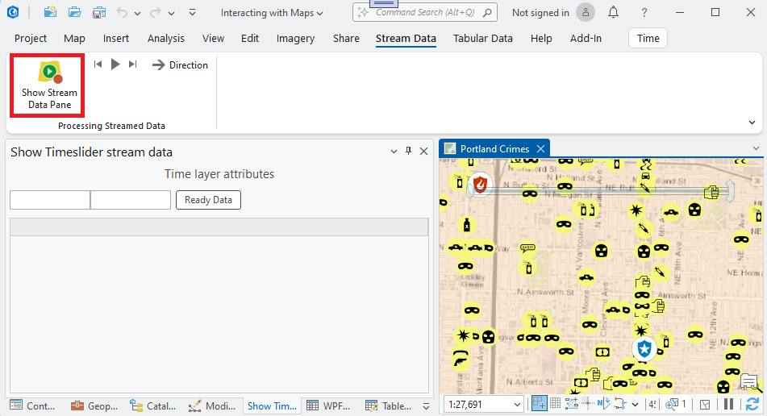
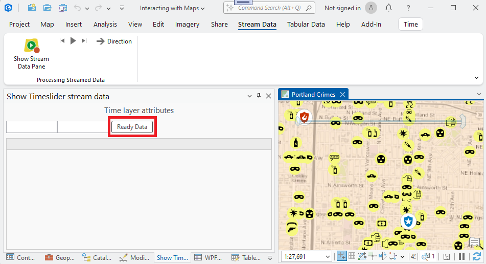
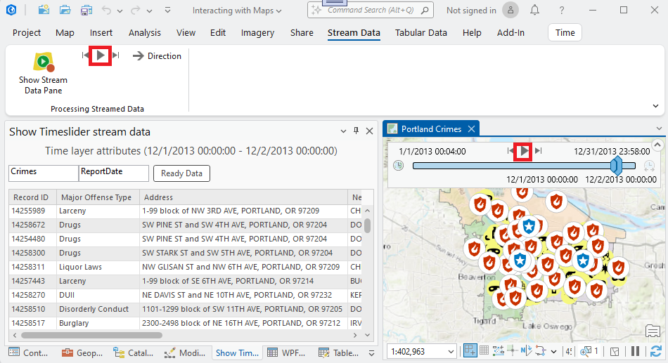

## TimeLayerAttributes

<!-- TODO: Write a brief abstract explaining this sample -->
This sample utilizes a time-enabled layer to emulate real-time data streaming through time extent change events captured by a dockpane.  The dockpane uses a data grid to display the 'streamed' (via time selection) data.  
  


<a href="https://pro.arcgis.com/en/pro-app/sdk/" target="_blank">View it live</a>

<!-- TODO: Fill this section below with metadata about this sample-->
```
Language:              C#
Subject:               Map Exploration
Contributor:           ArcGIS Pro SDK Team <arcgisprosdk@esri.com>
Organization:          Esri, https://www.esri.com
Date:                  11/01/2025
ArcGIS Pro:            3.6
Visual Studio:         2022
.NET Target Framework: net8.0-windows
```

## Resources

[Community Sample Resources](https://github.com/Esri/arcgis-pro-sdk-community-samples#resources)

### Samples Data

* Sample data for ArcGIS Pro SDK Community Samples can be downloaded from the [Releases](https://github.com/Esri/arcgis-pro-sdk-community-samples/releases) page.  

## How to use the sample
<!-- TODO: Explain how this sample can be used. To use images in this section, create the image file in your sample project's screenshots folder. Use relative url to link to this image using this syntax:  -->
1. Download the Community Sample data (see under the 'Resources' section for downloading sample data).  The sample data contains required data for this sample add-in.  Make sure that the Sample data is unzipped in c:\data and "C:\Data\Interacting with Maps" is available.
2. In Visual Studio click the Build menu. Then select Build Solution.  
3. Launch the debugger to open ArcGIS Pro.  
4. ArcGIS Pro will open.  
5. Open the "C:\Data\Interacting with Maps\Interacting with Maps.aprx" project which contains the required data needed for this sample.  
6. Make sure "Portland Crimes" is the active map and open the "Stream Data" tab on the ArcGIS Pro ribbon.  
7. Click the "Show Stream Data Pane" button to open the "Show Timeslider stream data" dockpane.  
  
8. Click the "Ready Data" button on the dockpane.  
  
9. This will locate the "Portland Crimes" layer in the TOC and set the time extent of the map to the time to the first day with data.  The dockpane displays the time extent settings for the time slider.  
  
10. Click the "Play Button" to start the time slider.  The dockpane listens to the time slider and updates the time extent settings and the data grid content accordingly.  
  
  

<!-- End -->

&nbsp;&nbsp;&nbsp;&nbsp;&nbsp;&nbsp;
&nbsp;&nbsp;&nbsp;&nbsp;&nbsp;&nbsp;&nbsp;&nbsp;&nbsp;&nbsp;&nbsp;&nbsp;
[Home](https://github.com/Esri/arcgis-pro-sdk/wiki) | <a href="https://pro.arcgis.com/en/pro-app/latest/sdk/api-reference" target="_blank">API Reference</a> | [Requirements](https://github.com/Esri/arcgis-pro-sdk/wiki#requirements) | [Download](https://github.com/Esri/arcgis-pro-sdk/wiki#installing-arcgis-pro-sdk-for-net) | <a href="https://github.com/esri/arcgis-pro-sdk-community-samples" target="_blank">Samples</a>
