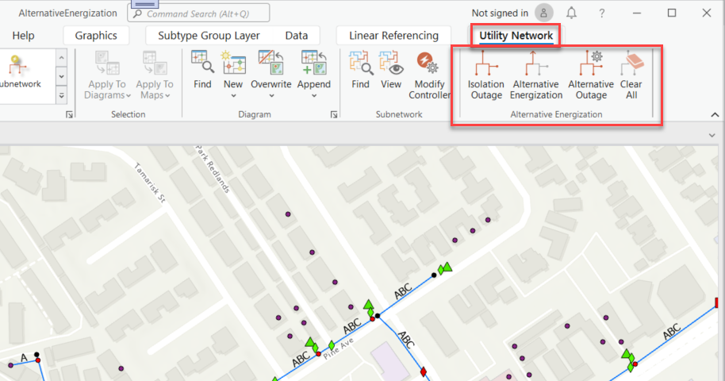
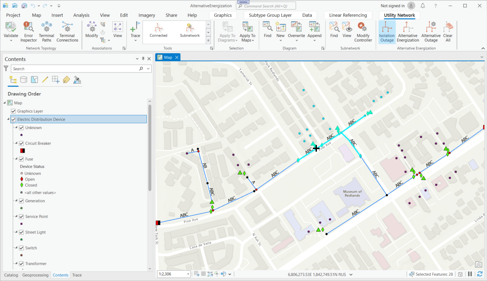
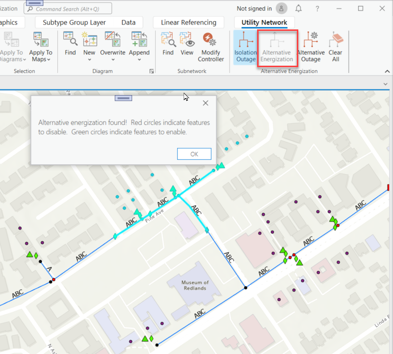
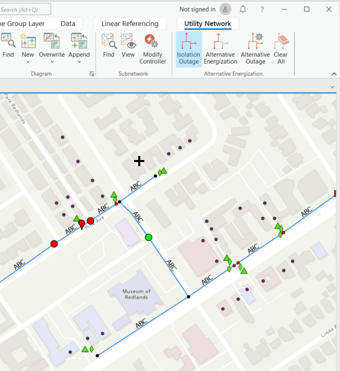
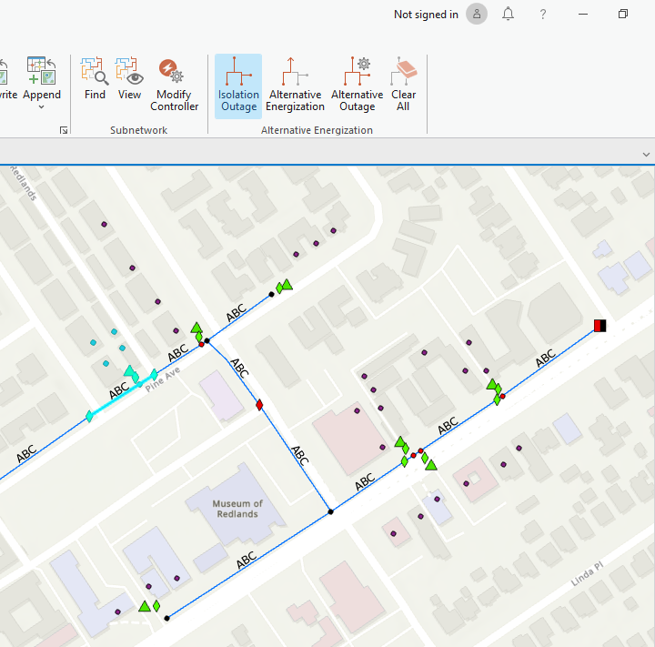

## AlternativeEnergizationAddIn

<!-- TODO: Write a brief abstract explaining this sample -->
This sample a tool to click on a utility network feature and run an isolation trace and then check for alternative energization capabilities.  The 'alternative energization' button shows red circle graphics on features that need to be disabled to isolate the selected feature and green circles on features that need to be enabled.  
  


<a href="https://pro.arcgis.com/en/pro-app/sdk/" target="_blank">View it live</a>

<!-- TODO: Fill this section below with metadata about this sample-->
```
Language:              C#
Subject:               Utility Network
Contributor:           ArcGIS Pro SDK Team <arcgisprosdk@esri.com>
Organization:          Esri, https://www.esri.com
Date:                  04/04/2024
ArcGIS Pro:            3.3
Visual Studio:         2022
.NET Target Framework: net8.0-windows
```

## Resources

[Community Sample Resources](https://github.com/Esri/arcgis-pro-sdk-community-samples#resources)

### Samples Data

* Sample data for ArcGIS Pro SDK Community Samples can be downloaded from the [Releases](https://github.com/Esri/arcgis-pro-sdk-community-samples/releases) page.  

## How to use the sample
<!-- TODO: Explain how this sample can be used. To use images in this section, create the image file in your sample project's screenshots folder. Use relative url to link to this image using this syntax:  -->
For sample data, download CommunitySampleData-UtilityNetwork-mm-dd-yyyy.zip from https://github.com/Esri/arcgis-pro-sdk-community-samples/releases and unzip it into c:\. We will be using the project in the "c:\Data\UtilityNetwork\" folder as an example for this AddIn.  
  
1. In Visual Studio open this solution and then rebuild the solution.
2. Click Start button to open ArcGIS Pro.  
3. ArcGIS Pro will open.   
4. Open the AlternativeEnergization.aprx file from the "C:\Data\UtilityNetwork\AlternativeEnergization" folder you just downloaded.    
5. Make sure that the map view that contains utility network data is the active map view.  
6. Open the 'Utility Network' tab on the Pro ribbon and note the 'Alternative Energization' group.  
  
7. Click the 'Isolation Outage' tool button and click on a network feature.  
  
8. This runs an isolation trace to find the upstream feature(s) that need to be opened in order to de-energize the selected network feature location.  
  
9. Click the 'Alternative Energization' button to find potential alternative energization points.  
  
10. If alternative methods of energization are found the add-in symbolizes Red circles to indicate features to disable and Green circles to indicate features to enable.  
  
11. Click the 'Alternative Outage' button to then run a trace showing what the outage will look like if the alternative energization features are disabled and enabled according to the Red and Green circles.  
  
  

<!-- End -->

&nbsp;&nbsp;&nbsp;&nbsp;&nbsp;&nbsp;
&nbsp;&nbsp;&nbsp;&nbsp;&nbsp;&nbsp;&nbsp;&nbsp;&nbsp;&nbsp;&nbsp;&nbsp;
[Home](https://github.com/Esri/arcgis-pro-sdk/wiki) | <a href="https://pro.arcgis.com/en/pro-app/latest/sdk/api-reference" target="_blank">API Reference</a> | [Requirements](https://github.com/Esri/arcgis-pro-sdk/wiki#requirements) | [Download](https://github.com/Esri/arcgis-pro-sdk/wiki#installing-arcgis-pro-sdk-for-net) | <a href="https://github.com/esri/arcgis-pro-sdk-community-samples" target="_blank">Samples</a>
