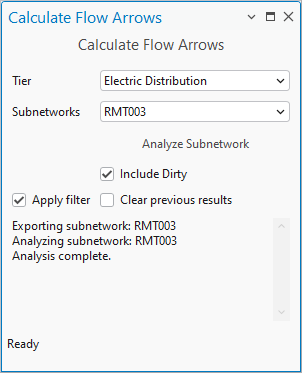

## CalculateFlowArrows

<!-- TODO: Write a brief abstract explaining this sample -->
This add-in allows a user to calculate and draw flow arrows for a subnetwork and display them in their map.  
  


<a href="https://pro.arcgis.com/en/pro-app/sdk/" target="_blank">View it live</a>

<!-- TODO: Fill this section below with metadata about this sample-->
```
Language:              C#
Subject:               Framework
Contributor:           ArcGIS Pro SDK Team <arcgisprosdk@esri.com>
Organization:          Esri, https://www.esri.com
Date:                  11/01/2025
ArcGIS Pro:            3.6
Visual Studio:         2022
.NET Target Framework: net8.0-windows
```

## Resources

[Community Sample Resources](https://github.com/Esri/arcgis-pro-sdk-community-samples#resources)

### Samples Data

* Sample data for ArcGIS Pro SDK Community Samples can be downloaded from the [Releases](https://github.com/Esri/arcgis-pro-sdk-community-samples/releases) page.  

## How to use the sample
<!-- TODO: Explain how this sample can be used. To use images in this section, create the image file in your sample project's screenshots folder. Use relative url to link to this image using this syntax:  -->
1. In Visual Studio open this solution and then rebuild the solution.
2. Click Start button to open ArcGIS Pro.  
3. ArcGIS Pro will open.   
4. Open a project and map that contains a utility network with one or more valid subnetworks.  
5. Open the 'Add-in' tab on the Pro ribbon and note the 'Show Flow Arrows' command.  
![UI] (Screenshots/LaunchAddIn.png)  
6. Click the 'Show Flow Arrows' command to open the dock pane for the add-in.  
![UI] (Screenshots/OpenDockpane.png)  
7. Select the Tier you want to analyze in the dropdown, this will populate the clean subnetworks for that tier.  
8. Select the Subnetwork you want to analyze and click the Analyze Subnetwork button.  
![UI] (Screenshots/SelectedSubnetwork.png)  
9. The tool will output several log messages as it exports and analyzes the subnetwork.  
  
10. Once the tool has finished, add the FlowLines layer to your map to visualize the results. A sample layer file is included in the project that includes suggested symbology.  
! [UI](Screenshots / CalculatedFlow.png)  
11.If the tool was run with the Apply Filter option selected, a definition query will be placed on the FlowLines layer and the map will zoom to the selected subnetwork.  
12.You can change the active subnetwork, or remove the filter, by modifying the definition query on the Flow Lines layer using the Ribbon or the layer properties dialog.  
  
  
# Options  
- Clear Previous Results -Choose whether to delete the contents of the FlowLines layer each time a subnetwork is analyzed.  
- Apply Filter - Choose whether a definition query will be added to the FlowLines layer in the map.  
-Include Dirty Subnetworks -The subnetworks dropdown doesn't show dirty subnetworks by default. Check this option to show clean and dirty subnetworks. Invalid subnetworks are never shown.  
  
# Known Limitations  
- The tool does not include propagators in it's analysis of flow. If you want the calcaulations to use propagation you will need to modify the community sample and recompile the add-in.  
- The tool only uses a single condition barrier, and the barrier is inferred from the subnetwork definition.If you require something more sophisticated you will need to modify the community sample and recompile the add-in.  
-The tool only analyzes a single subnetwork at a time.There is a hidden Analyze Tier button you can enable at your own risk. This requires modifying and recompiling the community sample.  
-By default, the tool only shows the first 3,000 subnetworks.If your dataset contains more subnetworks you can modify the command to show more, but you may experience performance issues.  
- By default, the tool does not limit the list of subnetworks to the current extent.Implementing logic like this would require modifying the community sample.  
-The tool does not include the ability to synthesize geometry or visualize the connectivity of non - spatial obects.  
  

<!-- End -->

&nbsp;&nbsp;&nbsp;&nbsp;&nbsp;&nbsp;
&nbsp;&nbsp;&nbsp;&nbsp;&nbsp;&nbsp;&nbsp;&nbsp;&nbsp;&nbsp;&nbsp;&nbsp;
[Home](https://github.com/Esri/arcgis-pro-sdk/wiki) | <a href="https://pro.arcgis.com/en/pro-app/latest/sdk/api-reference" target="_blank">API Reference</a> | [Requirements](https://github.com/Esri/arcgis-pro-sdk/wiki#requirements) | [Download](https://github.com/Esri/arcgis-pro-sdk/wiki#installing-arcgis-pro-sdk-for-net) | <a href="https://github.com/esri/arcgis-pro-sdk-community-samples" target="_blank">Samples</a>
